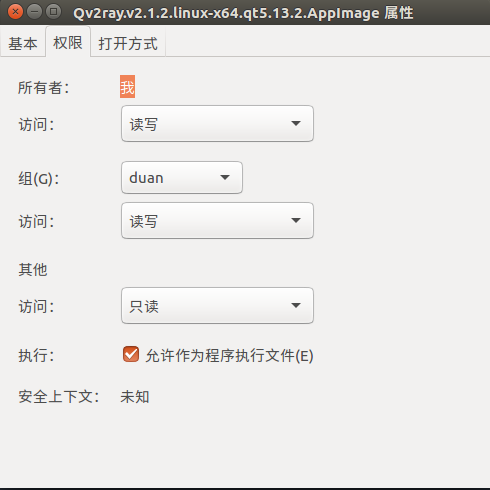
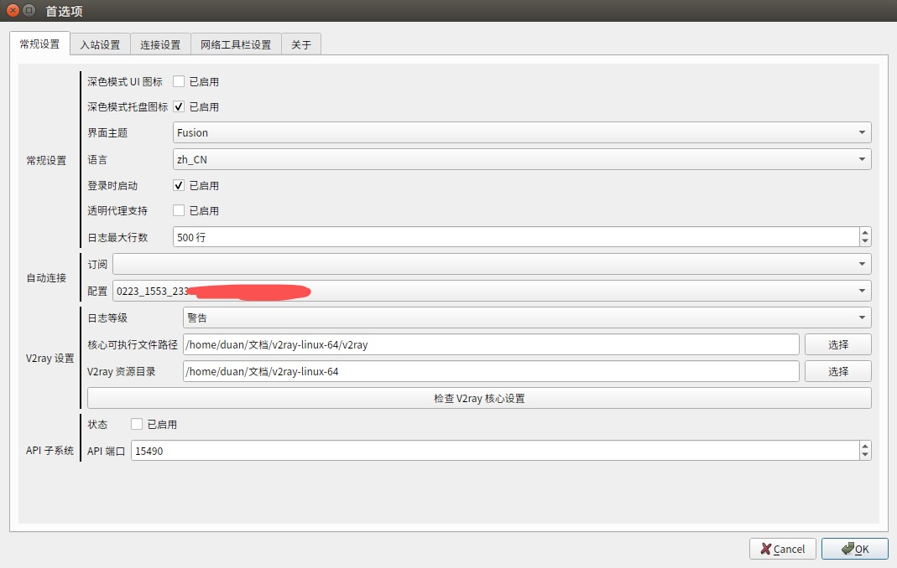
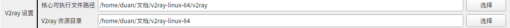
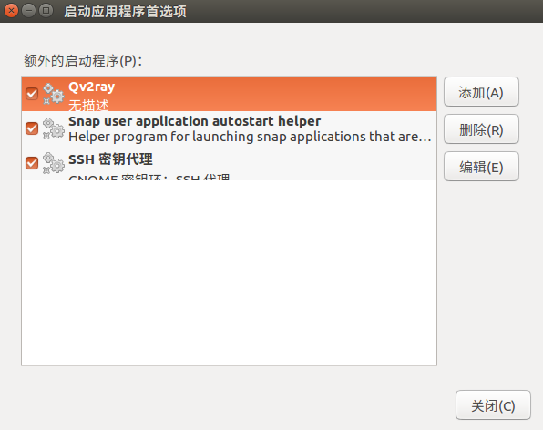

# `Ubuntu16.04`下v2ray的GUI客户端的使用，并自启动

> 其他版本`linux`和`Ubuntu`其他版本可以参考,如果下载无法使用,可以使用本项目备份的文件(Release)

## 准备: v2ray服务
首先当然你要有一个v2ray的服务啦，不论是买的还是自己搭建的

## 第一步: 下载v2ray的核心文件
前往[`v2ray/v2ray-core` 官方Release页面](https://github.com/v2ray/v2ray-core/releases)，并下载v2ray-linux-64.zip,解压存放到你认为不经常使用的文件夹下

## 第二步: 下载Qv2ray
从 [Qv2ray GitHub Release](https://github.com/Qv2ray/Qv2ray/releases) 页面下载Qv2ray编译好AppImage
文件,存放到你认为不经常使用的文件夹下

## 第三步: 允许权限并设置v2ray核心
右键点击AppImage文件,点击权限，勾选允许作为可执行文件


双击AppImage文件启动软件,点击设置


按照类似这样设置


## 第四步: 导入你的配置


## 第五步: 设置自启动
终端输入命令
```
gnome-session-properties
```



点击添加,写上名称,选择AppImage文件作为命令,就可以了
